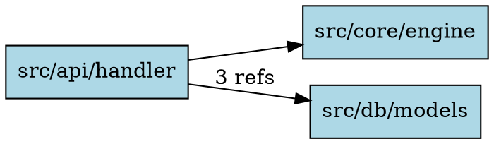

# graph

Export the raw dependency graph in DOT or JSON format.

## Usage

```bash
untangle graph <PATH> [OPTIONS]
```

## Arguments

| Argument | Description |
|----------|-------------|
| `PATH` | Path to the source directory (required) |

## Options

| Flag | Type | Description |
|------|------|-------------|
| `--lang` | `python\|ruby\|go\|rust` | Language to analyze. Auto-detected if omitted. |
| `--format` | `json\|dot` | Output format. Default: `dot`. |
| `--include-tests` | flag | Include test files. |
| `--include` | glob | Include glob patterns (repeatable). |
| `--exclude` | glob | Exclude glob patterns (repeatable). |
| `--quiet` | flag | Suppress progress output. |

## Examples

### Render as SVG with Graphviz

```bash
untangle graph ./src --lang go --format dot | dot -Tsvg -o deps.svg
```

### Render as PNG

```bash
untangle graph ./src --lang python --format dot | dot -Tpng -o deps.png
```

### Export as JSON for custom tooling

```bash
untangle graph ./src --lang rust --format json > graph.json
```

### Open in a browser (macOS)

```bash
untangle graph ./src --lang python --format dot | dot -Tsvg -o /tmp/deps.svg && open /tmp/deps.svg
```

## DOT Output

The DOT output produces a valid Graphviz `digraph` with:

- Left-to-right layout (`rankdir=LR`)
- Box-shaped nodes with language-based fill colors
- Edge labels showing reference count when a dependency appears in multiple import statements



## JSON Output

The JSON format includes `nodes` and `edges` arrays:

```json
{
  "nodes": [
    { "kind": "module", "path": "src/core/engine.py", "name": "src/core/engine" }
  ],
  "edges": [
    {
      "from": "src/api/handler",
      "to": "src/core/engine",
      "source_locations": [
        { "file": "src/api/handler.py", "line": 3, "column": 0 }
      ]
    }
  ]
}
```
