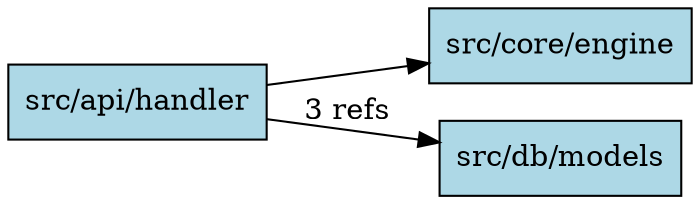

# DOT (Graphviz) Format

The DOT format produces a Graphviz-compatible `digraph` for dependency visualization.

## Usage

```bash
# Generate DOT and render to SVG
untangle graph ./src --lang go --format dot | dot -Tsvg -o deps.svg

# Render to PNG
untangle graph ./src --lang python --format dot | dot -Tpng -o deps.png

# Analyze command also supports DOT
untangle analyze ./src --lang rust --format dot | dot -Tsvg -o deps.svg
```

## Output Structure



### Features

- **Left-to-right layout** (`rankdir=LR`) for readability
- **Box-shaped nodes** with light blue fill
- **Edge labels** showing the number of import references when there are multiple import sites for the same edge

## Rendering Tools

DOT files can be rendered with:

- [Graphviz](https://graphviz.org/) (`dot`, `neato`, `fdp`)
- [D3-graphviz](https://github.com/magjac/d3-graphviz) for browser-based rendering
- VS Code extensions like "Graphviz Preview"
- Online tools like [Graphviz Online](https://dreampuf.github.io/GraphvizOnline/)

## Tips for Large Graphs

For large graphs, consider:

```bash
# Use fdp for force-directed layout (better for dense graphs)
untangle graph ./src --lang python --format dot | fdp -Tsvg -o deps.svg

# Exclude test files to reduce noise
untangle graph ./src --lang go --format dot --exclude "*_test.go" | dot -Tsvg -o deps.svg

# Use --include to focus on a subset
untangle graph ./src --lang python --format dot --include "src/core/**" | dot -Tsvg -o core.svg
```
